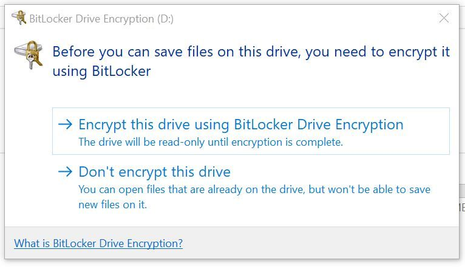
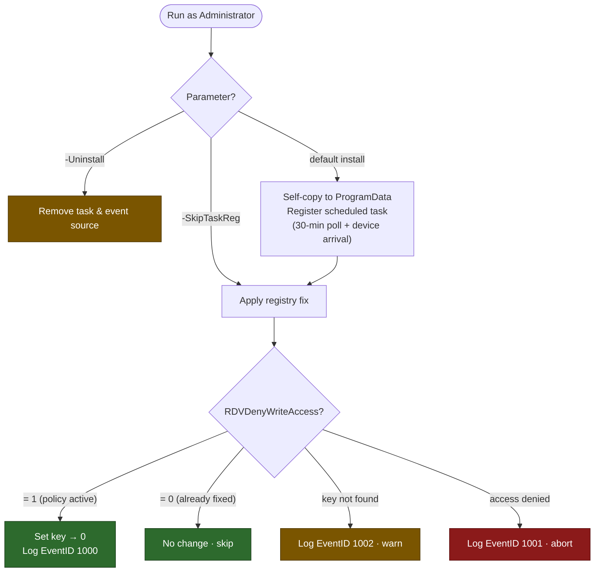

# Set-BitLockerRDVPolicy

<!-- BADGES:START -->
[](LICENSE) [](https://learn.microsoft.com/en-us/powershell/) [](https://www.microsoft.com/windows) [](https://github.com/5a9awneh/Set-BitLockerRDVPolicy/commits/main) [](https://github.com/5a9awneh/Set-BitLockerRDVPolicy)
<!-- BADGES:END -->

Resets the `RDVDenyWriteAccess` registry key and installs a self-healing scheduled task to keep it suppressed on Intune-managed Windows devices.

Windows Security Baseline 25H2 ships with `RDVDenyWriteAccess = 1` as a new default, which blocks write access to any unencrypted removable drive. This breaks bootable and multi-partitioned USB drives (Easy2Boot, WinPE, Autopilot offline provisioning) because BitLocker encryption on a removable volume breaks the boot chain — UEFI firmware won't recognize an encrypted drive during device provisioning.

---

**The problem — Windows prompts to encrypt every unencrypted USB drive before allowing writes:**



**After running the script, the prompt no longer appears and drives are writable immediately:**

```
Script installed to 'C:\ProgramData\Fix-BitLockerRDV\Fix-BitLockerRDV.ps1' - the original source file can now be deleted.
[14:22:07] RDVDenyWriteAccess set to 0 (was 1).
Scheduled task 'Fix-BitLockerRDVPolicy' registered (30-min poll + device-arrival trigger, runs as SYSTEM).

Done. Reconnect your external drive now if it's already plugged in.
```
*(representative)*



---

## 📋 Requirements

- Windows 10 / 11
- PowerShell 5.1+
- Must run as Administrator

---

## 🚀 Usage

**One-time install (recommended):**
```
Run.bat
```
Elevates to Administrator, applies the fix, and registers the scheduled task. No further action needed.

**Direct invocation:**
```powershell
.\Set-BitLockerRDVPolicy.ps1
```

**Apply fix once without installing the task:**
```powershell
.\Set-BitLockerRDVPolicy.ps1 -SkipTaskReg
```

**Uninstall:**
```powershell
.\Set-BitLockerRDVPolicy.ps1 -Uninstall
```

---

## ⚙️ Parameters

| Parameter | Type | Description |
|---|---|---|
| `-SkipTaskReg` | Switch | Apply the registry fix once; skip scheduled task registration |
| `-Uninstall` | Switch | Remove the scheduled task and Windows Event Log source |

---

## 🔧 How It Works

1. Sets `HKLM:\SYSTEM\CurrentControlSet\Policies\Microsoft\FVE\RDVDenyWriteAccess` → `0`, restoring write access to removable drives without requiring BitLocker encryption
2. Installs a scheduled task running as SYSTEM with two triggers:
   - **Every 30 minutes** — catches Intune policy re-tattoo between reboots
   - **On storage device arrival** (Kernel-PnP EventID 400, 5-second delay) — resets the key the moment a drive is connected
3. Self-copies to `%ProgramData%\Fix-BitLockerRDV\` so the source file can be deleted after install; the task always runs from the permanent location

---

## 📁 Logs

| Item | Detail |
|---|---|
| Log file | `%ProgramData%\Fix-BitLockerRDV\fix.log` |
| Rotation | Auto-rotated to `fix.log.old` at 5 MB |
| Event Log | Windows Application log, source `Fix-BitLockerRDV` (EventID 1000 = success, 1001 = error, 1002 = key not found) |

---

## ⚠️ Notes

- The scheduled task persists across Intune policy re-tattoo because it runs as SYSTEM with `StartWhenAvailable = true`
- Do **not** apply BitLocker encryption to bootable or multi-partitioned drives (Easy2Boot, WinPE, Autopilot provisioning USB) — it will break them regardless of this fix
- If your organisation wants to fully block USB drives, disabling the `RDVDenyWriteAccess` workaround and enforcing drive removal via Device Control is the correct approach — not forcing BitLocker encryption
- To fully remove: `.\Set-BitLockerRDVPolicy.ps1 -Uninstall`

---

## 📄 License

MIT — see [LICENSE](LICENSE)
